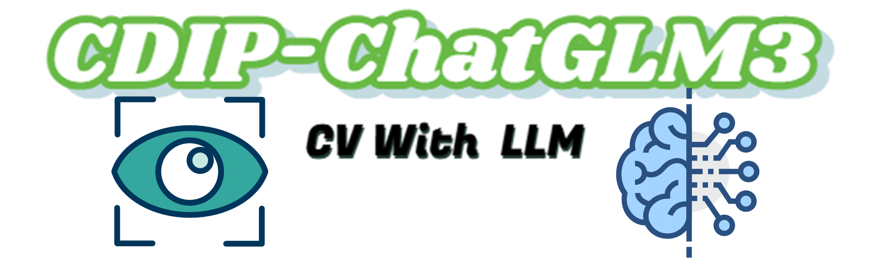

# CDIP-ChatGLM3: A Dual-Model Approach Integrating  Computer Vision and Language Modeling for Crop Disease  Identification and Prescription



**Crop disease identification and prescription using CNNs, ChatGLM3-6b, and Fine-tuned models**

https://github.com/user-attachments/assets/a098d6a3-00a9-4350-abe1-4187ef419887

https://github.com/user-attachments/assets/17621a5a-9d07-49d8-9760-ac859c511b9e

https://github.com/user-attachments/assets/e2cac48e-b38c-42f7-a41e-f4dcf88bf9b4

## Prerequisites

### Clone the Repository

Before starting with dataset preparation, clone the repository by running:

```
git clone git@github.com:SmartAG-Team/CDIP-ChatGLM3.git
```

Navigate to the project directory:

```
cd CDIP-ChatGLM3
```

### Environment Setup

The environment is developed with **Python 3.10**. To set up the environment, please install the required dependencies by running:

```
pip install -r requirements.txt
```

### Configuration

If you plan to create the instruction-following dataset yourself, you need to create a `.env` file in the working directory with the following configuration:

1. For Llama Model
   - Add `Llama_API_KEY` and `Llama_API_base_url`.
2. For Qwen Model
   - Add `Qwen_API_KEY` and `Qwen_API_base_url`.
3. For GPT Model
   - Add `OpenAI_API_KEY` and `OpenAI_API_base_url`.

If you plan to use a multimodal model, you also need to add the following configuration:

1. For DeepSeek Model, we use a third-party [SiliconFlow](https://siliconflow.cn/zh-cn/) API to request the DeepSeek-VL2 model.
   - Add `Deepseek_API_Key`  and `Deepseek_API_base_url`.
2. For GLM Model
   - Add `GLM_API_Key`.
3. For InternVL Model, we use a third-party [giteeAI](https://ai.gitee.com/) API to request the InternVL2.5 model.
   - Add `InternVL_API_Key` and `InternVL_API_base_url`.
4. For Llama-3.2-11B-Vision-Instruct, MiniCPM-V-2.6, and LLaVA-v1.6-7B models, we are using the open source framework ollama to build them locally. Please visit the [ollama website](https://ollama.com) to download these models for local invocation.

## Model

### CV Models

The metrics and resource links for the CV model we trained:

All pretrained and one of our trained models link：[CV models](https://pan.baidu.com/s/1aCelW_Jf83OradM24sVecA?pwd=ssw6 ) 

Below are the test results of ten vision models, along with their corresponding 95% confidence intervals (CIs).

| Model                 | Acc(%)     | Pre(%)     | Recall(%)  | F1(%)      | Params (M) | Pretrained model source                                      | Trained model source                                         |
| --------------------- | ---------- | ---------- | ---------- | ---------- | ---------- | ------------------------------------------------------------ | ------------------------------------------------------------ |
| EfficientNet-B0       | 97.18±1.54 | 95.87±2.09 | 95.79±3.12 | 95.64±3.04 | 4.09       | [efficientnetb0.pth](https://pan.baidu.com/s/1xfkebnTcxqlfKfDsDQMGIQ?pwd=vp1r ) | [efficientnetb0.pth](https://pan.baidu.com/s/1YtHDJNv_KCQb0yLV9Ye9pQ?pwd=ktt2) |
| EfficientNet-B1       | 97.13±1.75 | 96.15±1.13 | 95.32±4.12 | 95.49±3.21 | 6.59       | [efficientnetb1.pth](https://pan.baidu.com/s/17vahH7sfBavx1LalnLxp2g?pwd=qvos ) | [efficientnetb1.pth](https://pan.baidu.com/s/1okKbkIgD-lKK_t4KxrzN6w?pwd=5ti5) |
| EfficientNet-B2       | 97.97±0.16 | 97.18±0.59 | 97.17±0.46 | 97.12±0.10 | 7.79       | [efficientnetb2.pth](https://pan.baidu.com/s/1kkBeaH695q20sNIXAEy44g?pwd=32ip) | [efficientnetb2.pth](https://pan.baidu.com/s/1CJYC9XNDWVHg5k02iFPrVA?pwd=tj70) |
| EfficientNetV2-S      | 88.70±4.07 | 90.05±3.28 | 88.70±4.07 | 88.52±3.86 | 20.26      | [pre_efficientnetv2-s.pth](https://pan.baidu.com/s/1ea7iSXEyDtpP7Ae5eulyrg?pwd=fn77) | [efficientnetv2s.pth](https://pan.baidu.com/s/11aEVqQtt-qvAp3ebuVj6eQ?pwd=p6nq) |
| FasterNet-T0          | 97.58±0.94 | 96.61±1.34 | 96.17±1.28 | 96.26±1.33 | 2.7        | [fasternet_t0.pth](https://pan.baidu.com/s/1_mCz89djzGmYUyzq9xGLAw?pwd=txm8) | [fasternett0.pth](https://pan.baidu.com/s/1ejkmvmAXlr_mlMY719FcpQ?pwd=gx3g) |
| FasterNet-T1          | 97.35±1.57 | 96.26±2.38 | 95.67±2.42 | 95.74±2.67 | 6.39       | [fasternet_t1.pth](https://pan.baidu.com/s/1i64AKVZRFJdg381AvB16pg?pwd=t8w9) | [fasternett1.pth](https://pan.baidu.com/s/1j4Mb-5PESKwChnbrj_z9AA?pwd=xoj6) |
| MobileNetV3-Small     | 95.65±0.92 | 95.59±0.97 | 93.82±0.98 | 94.30±0.91 | 1.58       | [mobilenet_v3.pth](https://pan.baidu.com/s/1nlUmOFWFEd0OD0BQTfKc1g?pwd=q1wq) | [mobilenet.pth](https://pan.baidu.com/s/1HI3h97JZMRx65NtDulBeaA?pwd=41jz) |
| ResNet-34             | 96.35±3.10 | 95.34±3.48 | 95.20±4.15 | 95.01±4.42 | 21.32      | [resnet34-pre.pth](https://pan.baidu.com/s/1Ruj_HyFCuM9YiSF56daCWw?pwd=ml6s) | [resnet32.pth](https://pan.baidu.com/s/1-WTE3YQdqueILxiUu56fZQ?pwd=gtky ) |
| ResNet-50             | 96.52±3.51 | 95.19±4.51 | 95.33±4.73 | 95.00±5.29 | 23.63      | [resnet50-pre.pth](https://pan.baidu.com/s/15vEomtAJWu1JBaMk0YX7GQ?pwd=mm6e) | [resnet50.pth](https://pan.baidu.com/s/1Z-F9ppa3-gv3Y0oekvOLGw?pwd=0egv) |
| Swin-transformer-Tiny | 97.21±3.11 | 96.52±3.59 | 95.59±4.15 | 95.78±4.36 | 27.57      | [swin_tiny_patch4.pth](https://pan.baidu.com/s/1-hrBCnrN9TaPMy1i8-pxJQ?pwd=zb2x) | [swin-transformer.pth](https://pan.baidu.com/s/1T7HTz7dj-PquMF9EtUTtGQ?pwd=5r81) |

### LLM Models

The metrics and resource links for the LLM model we trained:

All  LLM model link: [LLM_Models](https://pan.baidu.com/s/1nSAnwV84jVahTFojvV8tMQ?pwd=v7oj ) 

| Model                             | BLEU-4(‰) | Average ROUGE F-score(‰) | Error Rate (%) | Model Source                                                 |
| --------------------------------- | --------- | ------------------------ | -------------- | ------------------------------------------------------------ |
| ChatGLM3_6B                       | 85.86     | 127.51                   | 0.04           | [ChatGLM3-6B](https://pan.baidu.com/s/1OhiSK7lP7qk4n_nzqrnepQ?pwd=p1kr) |
| Lora3                             | 116.88    | 154.67                   | 3.08           | [Lora3](https://pan.baidu.com/s/1qWVKeHBfX0tMLXgGw7I-Xw?pwd=tmal) |
| Lora5                             | 123.93    | 158.41                   | 2.88           | [Lora5](https://pan.baidu.com/s/1TRxeZegVsl2tErQrCVCG6w?pwd=ijjp) |
| Lora10                            | 137.82    | 164.73                   | 1.12           | [Lora10](https://pan.baidu.com/s/1zRqD3NU8CMRFamr-eb79iA?pwd=vhz3) |
| Lora15                            | 139.65    | 165.30                   | 0.32           | [Lora15](https://pan.baidu.com/s/1QIPKEja8jsSs9l7Jxe-emw?pwd=aeyz) |
| Lora20                            | 142.95    | 167.35                   | 0.60           | [Lora20](https://pan.baidu.com/s/1O5pj8QB8MKkM8KFNm7aY-Q?pwd=8dmg) |
| Lora30                            | 139.75    | 164.33                   | 0.56           | [Lora30](https://pan.baidu.com/s/1V7CMqRU3-ZTbfCnn1OEG9Q?pwd=676c) |
| Freeze3                           | 155.66    | 175.40                   | 0.72           | [Freeze3](https://pan.baidu.com/s/1fXlzgRCAmeP1-aG5sCbyow?pwd=e7ik) |
| Freeze5                           | 203.78    | 211.70                   | 0.32           | [Freeze5](https://pan.baidu.com/s/1Bi2BZjOuJZkBBsMoilQJUg?pwd=y6mt) |
| Freeze10                          | 325.24    | 318.43                   | 0.24           | [Freeze10](https://pan.baidu.com/s/1LRmsBaRSnZmNSg5jS14lww?pwd=ukqr) |
| Freeze15                          | 378.81    | 364.74                   | 0.64           | [Freeze15](https://pan.baidu.com/s/17ctfdc3_aWtniq8_WuEhKQ?pwd=zlgh) |
| Freeze20                          | 390.77    | 376.62                   | 0.28           | [Freeze20](https://pan.baidu.com/s/1AVq07WYeBSRg3V6PO3NEqA?pwd=ktlr) |
| Freeze30                          | 410.70    | 395.09                   | 0.60           | [Freeze30](https://pan.baidu.com/s/1ueA3aO-TeawuB-36QG7HxA?pwd=o8wb) |
| Freeze10-MTL(S2.5K+G1.25K)        | 340.76    | 329.93                   | 0.32           | [Freeze10-MTL(S2.5K+G1.25K)](https://pan.baidu.com/s/1AmQxwNZX4ot9Z7vy_ZGz-A?pwd=h35t) |
| Freeze10-MTL(S2.5K+G2.5K)         | 352.36    | 338.22                   | 0.36           | [Freeze10-MTL(S2.5K+G2.5K)](https://pan.baidu.com/s/1h7V1IM7dAjpV7ha6oYS7SQ?pwd=f9zv) |
| Freeze10-MTL(S2.5K+G5K)           | 368.52    | 350.70                   | 0.20           | [Freeze10-MTL(S2.5K+G5K)](https://pan.baidu.com/s/1QU3XB0C0lOLv5G0fne9vxA?pwd=kfa2) |
| Freeze10-MTL(S2.5K+G10K)          | 370.23    | 355.27                   | 0.60           | [Freeze10-MTL(S2.5K+G10K)](https://pan.baidu.com/s/1xJtuvWMCTLXBAsgo9Anxww?pwd=ap6q) |
| Freeze10-MTL(S2.5K+G20K)          | 363.59    | 347.98                   | 1.04           | [Freeze10-MTL(S2.5K+G20K)](https://pan.baidu.com/s/1O6lD8AC9-if1rMmdFn3o0g?pwd=o7aq) |
| Freeze10(S2.5K)-DMT(S0.1K+G2.5K)  | 233.12    | 228.63                   | 0.08           | [Freeze10(S2.5K)-DMT(S0.1K+G2.5K)](https://pan.baidu.com/s/1kIFsybriOkxevOWdeYdEmg?pwd=ko72) |
| Freeze10(S2.5K)-DMT(S0.5K+G2.5K)  | 286.31    | 277.02                   | 0.08           | [Freeze10(S2.5K)-DMT(S0.5K+G2.5K)](https://pan.baidu.com/s/1fs9ezrRdfPGeQ4-b9UO_JQ?pwd=6bjz) |
| Freeze10(S2.5K)-DMT(S1.25K+G2.5K) | 344.19    | 329.08                   | 0.24           | [Freeze10(S2.5K)-DMT(S1.25K+G2.5K)](https://pan.baidu.com/s/1lBU2lIkdj7_uVzI8Pw-7Dw?pwd=uabu) |
| Freeze10(S2.5K)-DMT(S2.5K+G2.5K)  | 417.43    | 397.88                   | 0.08           | [Freeze10(S2.5K)-DMT(S2.5K+G2.5K)](https://pan.baidu.com/s/1NO_CqRcRgzzTx-FLI9ibEQ?pwd=zxc0) |
| Freeze10(S2.5K)-DMT(S2.5K+G5K)    | 445.46    | 425.80                   | 0.52           | [Freeze10(S2.5K)-DMT(S2.5K+G5K)](https://pan.baidu.com/s/1LcwH0HyI2-8JW_F4z4lUBg?pwd=w1r5) |

### Model Preparation

Please place your models under the `./model` directory.

## Dataset Preparation

### CV Dataset

Our dataset consists of **100,989 images**, covering **48 diseases** across **13 different crops**. You can download our CV dataset from [this link](https://pan.baidu.com/s/18jtQHJkfTKX7mzd01oDMFA?pwd=i73q) (password: `i73q`) and place it in the `./data/CV` directory.

### 13-Crop instruction-following Dataset

Path: `./data/LLM/LLM_dataset/13-Crop-Instruction-Following-Dataset` contains the 13-Crop instruction-following dataset.

Alternatively, you can create the dataset as follows:

- **Collection of Original Disease Control Books for 13 Crops**: (Provide source or link)

- **Manual Division, Cleaning, and Filtering**: Save the processed data to `./data/LLM/LLM_books`.

- **Constructing the 13-Crop Instruction-Following Dataset Using Llama3.1-405B-Instruct API**:

  To generate the corresponding instruction-following datasets for each crop's partitioned text information folder, use the script `./src/LLM/Fine-tuning/Create-dataset/create_dataset.py`. Specifically, the following parameters should be modified in the file:

  - `--folder_path`: The folder containing the partitioned chapter information.
  - `--prompt{1,2,3}_dir`: The folders containing the corresponding prompts for each crop. (Note: In `prompt1`, the crop name should be updated for each crop.)
  - `--instruction_number`: Specifies the number of instructions to generate for each folder.

  The instruction-following dataset generation process consists of three steps:

  - **Step 1 - `instruction_generation()`**: Generates a specified number of instructions based on the provided context.
  - **Step 2 - `original_output()`**: Generates raw answers based on the instructions.
  - **Step 3 - `output()`**: Generates refined and improved answers using the instructions, raw answers, and context.

-  After generating the instruction-following dataset, you can merge the data using the `./src/Fine-tuning/Create-dataset/merge_json.py` script.     Please ensure to modify the paths in the script to match the location of your data. This script will merge all the generated instruction data into a single, unified file for further processing or training.

### General Dataset: Alpaca

Path: `./data/LLM/LLM_dataset/General-Dataset-Alpaca` contains the Alpaca dataset and its data volume variant.

Alternatively, you can download the dataset from the following link: [llamafactory/alpaca_gpt4_zh at main](https://huggingface.co/datasets/llamafactory/alpaca_gpt4_zh/tree/main)

### CMMLU Benchmark Dataset

Path: `./data/LLM/LLM_dataset/CMMLU-Benchmark-Dataset` contains the CMMLU benchmark dataset.

Alternatively, you can download the dataset from the following link: [haonan-li/CMMLU: Measuring massive multitask language understanding in Chinese](https://github.com/haonan-li/CMMLU)

### Specialized Abilities Test Dataset

Path: `./data/LLM/LLM_dataset/Specialized-Abilities-Test-Dataset/Specialized-Abilities-Test-Dataset.json` contains the Specialized Abilities Test dataset.

Alternatively, you can create the dataset as follows:

- **Extract 200 Disease Prevention and Control Issues** from specialized datasets using the following command:

  ```
  python ./src/LLM/Specialized-Abilities-Test/Dateset-create/Dataset_extraction.py
  ```

  This will extract and save 200 disease control test cases to `./data/LLM/LLM_dataset/Specialized-Abilities-Test-Dataset/Crop-Disease-200.json`.

- **Generate Change Questions for the Specialized Abilities Test Dataset** using the Llama3.1-405B-Instruct API:

  ```
  python ./src/LLM/Specialized-Abilities-Test/Dateset-create/Generate-Specialised-Abilities-Test-Dataset.py
  ```

### Image Understanding Test Dataset

To evaluate the visual classification and comprehension capabilities of our dual-stage model and common multimodal models on disease images, we have constructed an image understanding test dataset. This dataset is built by extracting 10 images from each category of the CV dataset.

You can download the dataset directly from this [link](https://pan.baidu.com/s/1yvaJO364zmgpbx5pjGmezw?pwd=jm5e):

Alternatively, you can extract and build the dataset from the CV dataset by running the following command:

```
python ./src/LLM/Image-Understanding-Test/VLM-Image-Understanding-Test/Dateset-create/Dataset_extraction.py
```

## Training

### CV Training

Before training the CV models, please ensure the following:

1. The CV dataset is located in the `./data/CV/CV_dataset` directory.
2. Pretrained models are stored in the `./model/CV_Models/pretrain_model` directory.
3. CV model configurations are available in the `./model/CV_Model_Config` directory.
4. Training and validation scripts are located in the `./src/CV/Train-val` directory.

To start training, you can run the following Python code:

```
python ./src/CV/Train-val/{model}/train.py
```

Replace `{model}` with the specific model you are testing. Available options are:

- `efficientnet/b0`
- `efficientnet/b1`
- `efficientnet/b2`
- `efficientnetv2`
- `fasternet/t0`
- `fasternet/t1`
- `mobilenet`
- `resnet/34`
- `resnet/50`
- `swin-transformer`

The trained model will be saved in the `./model/CV_Models/trained_model` directory.

### LLM Training

Before fine-tuning the LLM, please ensure that the original [THUDM/chatglm3-6b · Hugging Face](https://huggingface.co/THUDM/chatglm3-6b) model is downloaded to the path `./model/LLM_Models`. Next, you can fine-tune the model using the **[LLaMA-Factory](https://github.com/hiyouga/LLaMA-Factory)**. 

Alternatively, you can use the training files we have provided for fine-tuning.

You can follow the steps below to use the provided training files:

1. Configuration files for all fine-tuned models are stored in the `./model/LLM_Config` directory.
2. Fine-tuning training files are stored in the `./src/LLM/LLaMA-Factory/finetune` directory, which includes two different fine-tuning methods. You can either run the training files directly or use the CLI to run them. An example is as follows:

```
python ./src/LLM/LLaMA-Factory/finetune/lora_finetune/lora3.py
```

Please note that when using the DMT training strategy, ensure that the `Freeze10` model is stored in the `./model/LLM_Models` directory.

After the training is complete, the model needs to be post-processed: For the Lora method, use the following script to merge the model:

```
python ./src/LLM/LLaMA-Factory/finetune/lora_finetune/lora_merge.py
```

## Results

### CV-Model Test

After placing the corresponding CV models in the `./model/CV_Models/trained_model` directory, you can test the models. Our CV testing results consist of two main components:

1. **Model Performance**: We evaluate and compare the **Accuracy**, **Recall**, **F1-score**, and **Precision** of 10 models to identify the best-performing model.
2. **Disease Identification Accuracy**: The prediction results are displayed by calculating the accuracy for each type of disease prediction.

#### **Model Performance**

To test the performance of the CV models, you can run the following Python code:

```
python ./src/CV/Train-val/{model}/test.py
```

Replace `{model}` with the specific model you are testing. Available options are:

- `efficientnet/b0`
- `efficientnet/b1`
- `efficientnet/b2`
- `efficientnetv2`
- `fasternet/t0`
- `fasternet/t1`
- `mobilenet`
- `resnet/34`
- `resnet/50`
- `swin-transformer`

#### **Disease Identification Accuracy**

To test the disease identification accuracy of the best model, you can run the following code:

```
python ./src/CV/Others/CV_confusion_matrix.py
```

This will generate a confusion matrix for all diseases predicted by the model and save the results in `./data/CV/CV_confusion_matrix.csv`

### Fine-Tuning Test

The results of our fine-tuning experiments consist of three main components:

1. **LLM-Generated Responses**: The answers generated by the fine-tuned LLM in response to the 13-crop instruction-following dataset questions.
2. **BLEU and ROUGE Scores**: These scores are calculated by comparing the generated answers with standard answers.
3. **Error Rate**: The error rate is defined as the percentage of responses that generated more than 5,000 tokens during repeated answer generation, which are considered errors.

#### **LLM-Generated Responses**

- The responses generated by the fine-tuned LLM are stored in `./data/LLM/LLM_Model_Response`. Each model provides answers to the questions in the 13-Crop dataset.

- To regenerate responses using the fine-tuned model, run:

  ```
  python ./src/LLM/Fine-tuning/Generate_LLM_Response.py
  ```

  This command uses the fine-tuned LLM to generate answers based on the dataset's questions.

- Since different fine-tuned models may respond to prompts in different ways, some responses may not adhere to the standard output format specified in the prompt. To ensure standardized formatting, run:

  ```
  python ./src/LLM/Fine-tuning/Trimming_LLM_Reply.py
  ```

  Ensure to manually adjust any paths as needed.

#### **BLEU and ROUGE Scores**

- The BLEU and ROUGE evaluation scores are stored in `./data/LLM/LLM_Metric/Fine-tuning-Metric`. These scores are calculated by comparing the LLM-generated responses with standard answers.

- To re-evaluate the fine-tuning experiment, ensure the fine-tuned responses are saved in `./data/LLM/LLM_Model_Response`, then run:

  ```
  python ./src/LLM/Fine-tuning/Calculate_score.py
  ```

#### **Error Rate**

- The error rate metric is stored in `./data/LLM/LLM_Metric/Error-rate-Metric`.

- To re-evaluate the error rate, ensure the fine-tuned responses are saved in `./data/LLM/LLM_Model_Response`, then run:

  ```
  python ./src/LLM/Fine-tuning/Error_Rate/Error_Rate_Token.py
  ```

### CMMLU Benchmark Test

Our CMMLU experiment results are stored in `./data/LLM/LLM_Metric/CMMLU-Metric`, with each experiment folder labeled as "Test{number}" to indicate the iteration. Each experiment folder contains Zero-shot and Five-shot accuracy metrics (`accuracy`) and detailed response results (`results`).

#### Validation

To generate evaluation metrics for CMMLU based on the experiment results, run:

```
python ./src/LLM/CMMLU/CMMLU_Get_Metrics.py
```

This script aggregates the CMMLU benchmark results and saves them to `./data/LLM/LLM_Metric/CMMLU-Metric/CMMLU_Metric.csv`.

#### Evaluation

To re-evaluate CMMLU using the model, run:

```
python ./src/LLM/CMMLU/chatglm.py
```

Make sure to manually adjust the model path, shot count, and perform multiple experiments as needed.

### Specialized Abilities Test

The results of our Specialized Abilities Test are stored in `./data/LLM/LLM_Metric/Specialized-Abilities-Test-Metric/LLM_Response`, where each LLM model has provided answers to all the questions in the test dataset.

#### Validation

To generate evaluation metrics for the Specialized Abilities Test based on the experiment results, run:

```
python ./src/LLM/Specialized-Abilities-Test/Specialized-Abilities-Test-Get-Metric.py
```

This script calculates the average BLEU and ROUGE scores for each model's responses and saves them to `./data/LLM/LLM_Metric/Specialized-Abilities-Test-Metric/Specialized-Abilities-Test-Metric.csv`.

#### Evaluation

To re-evaluate the specialized abilities in disease prevention and control for different LLM models, run the following commands:

- **ChatGLM3-6B**:

  ```
  python ./src/LLM/Specialized-Abilities-Test/Test/ChatGLM3-6B.py
  ```

- **Qwen-Max**:

  ```
  python ./src/LLM/Specialized-Abilities-Test/Test/qwen-max.py
  ```

- **Llama-3.1-405B-Instruct**:

  ```
  python ./src/LLM/Specialized-Abilities-Test/Test/llama3.1-405b-instruct.py
  ```

- **GPT-4o**:

  ```
  python ./src/LLM/Specialized-Abilities-Test/Test/gpt4o.py
  ```

- **CDIP-ChatGLM3**:

  ```
  python ./src/LLM/Specialized-Abilities-Test/Test/CDIP-ChatGLM3.py
  ```

After generating results for each model, run:

```
python ./src/LLM/Specialized-Abilities-Test/Specialized-Abilities-Test-Metric.py
```

This will update the metrics in `./data/LLM/LLM_Metric/Specialized-Abilities-Test-Metric/Specialized-Abilities-Test-Metric.csv`.

### Image Understanding Test

#### Vison Test

Our Image Understanding Test visual results are stored in `./data/CV/CV_Metric/VLM-Test-Metric`.

Alternatively, you can re-evaluate the image understanding capabilities of the multimodal models by running the following command:

```
python ./src/LLM/Image-Understanding-Test/VLM-Image-Understanding-Test/{model}.py
```

Replace `{model}` with the specific model you are testing. Available options are:

- `deepseekvl2`
- `glm4v-plus-0111`
- `InternVL2.5`
- `llama3.2-vision-11b`
- `llava1.6-7b`
- `minicpm-v-8b`
- `Qwen2.5-VL-72B`

#### LLM Test

The test results of the multimodal models on the Specialized-Abilities-Test-Dataset are saved in `./data/LLM/LLM_Metric/Specialized-Abilities-VLM-Test-Metric`

To re-evaluate, please refer to the files under the `./src/LLM/Image-Understanding-Test/VLM-LLM-Response`

### Figs Generation

After collecting the following six data files

- `./data/CV/CV_Metric/CV_results_1.csv`
- `./data/CV/CV_Metric/CV_results_2.csv`
- `./data/CV/CV_Metric/CV_results_3.csv`
- `./data/CV/CV_Metric/CV_confusion_matrix.csv`
- `./data/LLM/LLM_Metric/CMMLU-Metric/CMMLU_Metric.csv`
- `./data/LLM/LLM_Metric/Error-rate-Metric/Error-rate-Metric-token.csv`
- `./data/LLM/LLM_Metric/Fine-tuning-Metric/Fine-tuning-Metric.csv`
- `./data/LLM/LLM_Metric/Specialized-Abilities-Test-Metric/Specialized-Abilities-Test-Metric.csv`

you can generate all the data images using the provided code:

```
python ./src/All_fig.py
```

Alternatively, if you wish to generate specific images, you can modify the `fig{num}()` function in the script to specify which image you would like to generate.

Please ensure that all the required data files are available before running the image generation code. All generated images, including those created using Visio, will be stored in the `./fig` directory for easy access and further use.
